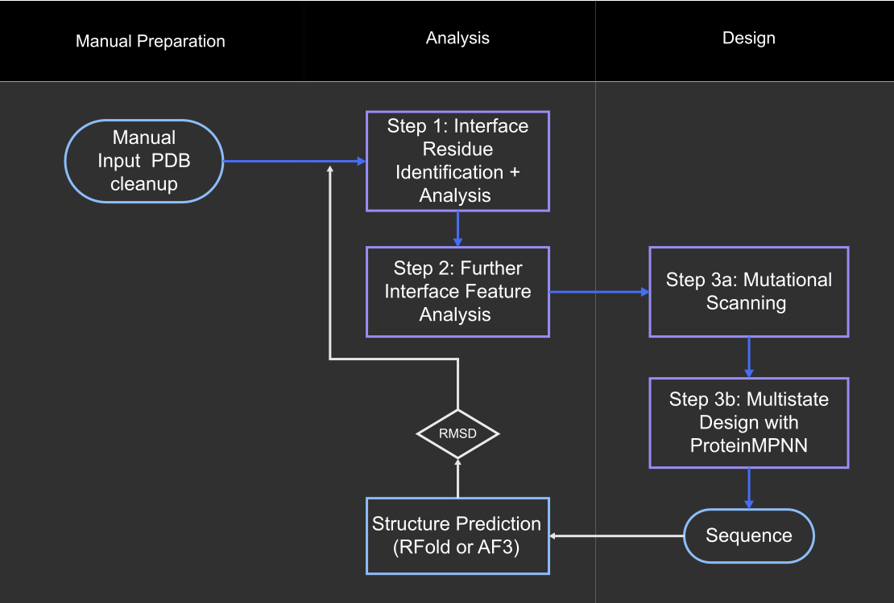

# Implementation of a protein complex analysis and interface design pipeline

* Main code for analysis and design: `interface.ipynb`
* Slides can be found in **Presentaion.pdf**

# Requierements
You need to have a **pyrosetta** wheel file available.  
https://graylab.jhu.edu/download/PyRosetta4/archive/release/

# Setup

Install dependencies using uv.

1. Install uv
```
# Install uv
curl -LsSf https://astral.sh/uv/install.sh | sh
```
2. Edit the pyrosetta wheel path in `pyproject.toml`
3. Install dependencies

```
# Setup venv
uv sync
```

# Overview
